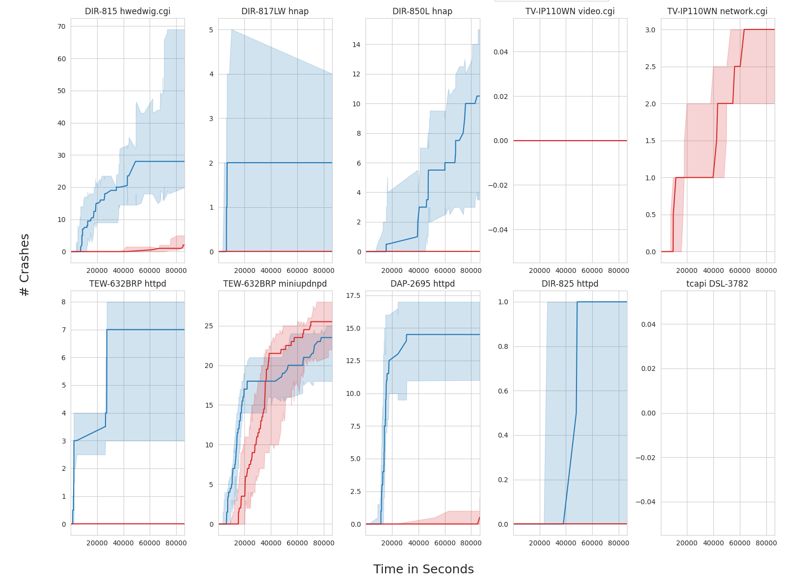

# Artifact Evaluation: FIRM-AFL

This repository holds the code for an independent artifact evaluation for the paper "FIRM-AFL: High-Throughput Greybox Fuzzing of IoT Firmware via Augmented Process Emulation" published at USENIX Security 2019. It provides automation for building FIRM-AFL in different setups, running a core part of the experiments, and visualizing the results afterwards.

### FIRM-AFL version

Two different versions of FIRM-AFL have been published on github, the [original](https://github.com/zyw-200/FirmAFL) and an updated [2020 version](https://github.com/zyw-200/FirmAFL_2020). For our re-evaluation, we use the 2020 version on commit `1cb62a3` mirrored [here](https://github.com/fuzz-evaluator/FirmAFL-upstream).

### Missing experiments

In our re-evaluation, we focused on the experiments described in Section 5.4 "Vulnerability Discovery".

We did not attempt to reproduce the results described in Section 5.1 "Transparency", 5.2 "Efficiency" , and 5.3 "Effectiveness of Optimization" due to missing build instruction and configuration details for the according experiments.

Furthermore, for the Vulnerability Discovery experiments, we could only complete full experiments for 8 out of 11 target for the reasons listed below:

| Vendor    | Model         | Program       | Reason                                    |
| --------- |-------------- | ------------- | ----------------------------------------- |
| Trendnet  | TV-IP110WN    | network.cgi   | Fuzzing does not start in augmented mode  |
| TPLink    | WR940N        | httpd         | Missing configuration files               |
| DLink     | DSL-3782      | tcapi         | Missing configuration files               |


## Experiments


For easy replication and consistency, we chose to dockerize all our experiment.
We provide three different Dockerfiles for each setup in which we ran FIRM-AFL.

| Setup                 | Description                                               | Dockerfile                         |
| --------------------- | --------------------------------------------------------- | ---------------------------------- |
| firmafl               | FIRM-AFL in augmented mode                                 | [link](./Dockerfile)               |
| firmafl-full          | Full-system emulation mode as provided by FIRM-AFL         | [link](./Dockerfile.full)          |
| firmafl-full-afl2.52b | Full-system emulation mode with adjusted AFL version      | [link](./Dockerfile.full-afl2.52b) |

Note that for firmafl-full, we followed the setup description and code as provided by the authors.
During our experiments, we noted that (1) this mode does not use the lightweight snapshot as discussed in the paper, and (2) uses an older AFL version than the one provided to FIRM-AFL in augmented mode.
While we could not identify a clear way forward to enable (1) due to code guarded by undocumented compiler macros, we fixed (2) by providing a third setup which uses the same AFL version as the plain firmafl setup.

Based on our observations, we believe our setups correspond to the setups (a) and (d) described in Section 5.2 of the FIRM-AFL paper.

### ID Mapping

FIRM-AFL uses experiment IDs to refer to the different firmware samples, and hardcodes emulator behavior based on the experiment ID.
Below, we provide the mapping between experiment ID, target program, and firmware sample:


| Experiment ID  | Firmadyne ID | Arch   | Vendor    | Model      |  Program    | Firmware File
| -------------- |------------- | ------ | --------- | ---------- | ----------- | --------------------------------------------- |
| 9925           |  9925        | mips   | dlink     | DAP-2695   | httpd       | DAP-2695_REVA_FIRMWARE_1.11.RC044.ZIP         |
| 9050           |  9050        | mipsel | dlink     | DIR-815    | hedwig.cgi  | DIR-815_FIRMWARE_1.01.ZIP                     |
| 9054           |  9054        | mips   | dlink     | DIR-817LW  | hnap        | DIR-817LW_REVA_FIRMWARE_1.00B05.ZIP           |
| 10566          |  10566       | mips   | dlink     | DIR-850L   | hnap        | DIR-850L_FIRMWARE_1.03.ZIP                    |
| 10853          |  10853       | mips   | dlink     | DIR-825    | httpd       | DIR-825_REVB_FIRMWARE_2.02.ZIP                |
| 161160         |  16116       | mips   | trendnet  | TEW-632BRP | miniupnpd   | tew-632brpa1_(fw1.10b32).zip                  |
| 161161         |  16116       | mips   | trendnet  | TEW-632BRP | httpd       | tew-632brpa1_(fw1.10b32).zip                  |
| 129780         |  12978       | mips   | trendnet  | TV-IP110WN | video.cgi   | fw_tv-ip110wn_v2\(1.2.2.68\).zip              |
| 129781         |  12978       | mips   | trendnet  | TV-IP110WN | network.cgi | fw_tv-ip110wn_v2\(1.2.2.68\).zip              |
| N/A            |  N/A         | mips   | tplink    | WR940N     | httpd       | TL-WR940N(US)_V4_160617_1476690524248q.zip    |
| N/A            |  N/A         | mips   | dlink     | DSL-3782   | tcapi       | DSL-3782_A1_EU_1.01_07282016.zip              |
                                        
The two samples without Experiment ID are missing FIRM-AFL config files and are not part of the original [Firmadyne database](https://zenodo.org/record/4922202/files/data.xz).


### Setup

To run the experiments, you first need to build the different docker images using the provided dockerfiles:

```
$ docker build -t firmafl -f Dockerfile .
$ docker build -t firmafl-full -f Dockerfile.full .
$ docker build -t firmafl-full-afl2.52b -f Dockerfile.full-afl2.52b .
```

We strongly encourage to use the same image tags, as these will be used in the automation for running multiple experiments.

### Running a single experiment manually

To run a single experiment, spin up a docker container and use the [run_experiment.sh](./run_experiment.sh) script.
It expects the experiment ID and the anticipated fuzzing time as arguments.

For instance, to fuzz experiment 9050 using FIRM-AFL in augmented mode for 24 hour, run the following commands:

```
$ docker run --privileged -i -t firmafl /bin/bash
root@[container_id]:/workspaces/firmafl-repro# ./run_experiment.sh 9050 86400
```

This will automatically extract the firmware sample corresponding to experiment 9050 using [extract_one.sh](./extract_one.sh), set up the configuration required for fuzzing, and start the fuzzing process.

Note that privileged mode for docker is required for unpacking the firmware via firmadyne, as it temporarily mounts the to-be-extracted firmware image.

### Running multiple experiments automatically

Assuming you named the docker images as above, you can use the [run_experiment_batch.sh](./batch-scripts/run_experiment_batch.sh) script to run multiple experiments in the different setups at the same time. Each experiment will be executed in a separate docker container to avoid collision of experiment state (e.g., due to overlapping network interfaces created for each experiment).

The script takes a file containing the experiments to run (by ID), the number of trials per experiment, and the time budget for each experiment in seconds as input.
 or instance, to run all experiments which we run for 24 hours with ten repetitions, execute the following:

```
$ ./batch-scripts/run_experiment_batch.sh ./batch-scripts/config_ids.txt 10 86400
```

Note that this will create 8 x 10 x 3 = 240 fuzzing instances, which each will attempt to bound to a separate CPU core. When less resources are available on a physical machine, we suggest to split up the experiments or different amounts of repetitions across different machines.

Note that during our experiments, the fuzzer was not able to spin up in all cases due to non-deterministic errors with the FIRM-AFL setup. We resided to repeat the according runs and merge results from 10 successful runs.

### Collecting results

To collect the results after running the fuzzers via `run_experiment_batch.sh`, run the following after all fuzzing runs have concluded:

```
$ ./batch-scripts/copy_fuzzing_results.sh ./batch-scripts/config_ids.txt 10 86400
```

After running this script you can find the collected results under `../firmafl-outputs`.

### Visualizing results

After running the experiments and collecting the results, use the provided jupyter notebook [gen_plots.ipynb](./gen_plots.ipynb) to visualize the found crashes over time.


## Re-Evaluation Results

Please refer to the paper for the hardware details. Unfortunately, during our reproduction attempts, our adjusted version of the full mode with an updated fuzzer (`full-afl-2.52b`) had substantial stability issues and barely discovered any crashes, which is why we re resort to only visualize the normal firmafl and firmafl-full results below allowing for a direct comparison to the plots reported in the FIRM-AFL paper.



Note that for TV-IP110WN network.cgi only the full mode was running, and tcapi DSL-3782 had a missing configuration file. For the other results, we can see that FIRM-AFL clearly outperforms the baseline for most targets, with the exception of TP-IP110WN video.cgi, where neither mode found crashes, and TEW-632BRP miniupdnpd, where the baseline outperforms augmented mode.